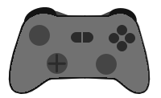

Game-Input (JavaScript) Library
=============


A client-side JavaScript module one can import to add good gamepad support to web-powered games or other gamepad-powered web applications.

```js
import { GameInput } from './gameinput.js'

const gameInput = new GameInput()
// Events style
    .onReinitialize(() => {
        console.debug("Players updated")
        const firstPlayer = this.gameInput.getPlayer(0)
        if (!firstPlayer?.model) {
            noPlayers()
            return
        }
        displayButtons(firstPlayer?.type.buttonNames)
        document.querySelector('img.gamepad').src = `img/${firstPlayer?.model?.iconName || 'generic'}.png`
    })
    .onButtonDown((index, button) => {
        const player = this.gameInput.getPlayer(index)
        console.debug(`Player ${player} pushed ${player.getButtonText(button)} (${button})`)
        switch (button) {
        case GameInputButtons.menu:
            break
        default:
            break
        }
    })
    .onButtonUp((index, button) => {
        const player = this.gameInput.getPlayer(index)
        console.debug(`Player ${player} released ${player.getButtonText(button)} (${button})`)
    })

// Game-Loop Style
const gameLoop = function () {
    for (let i = 0; i < 4; i++) {
        const player = gameInput.getPlayer(4)
        if (!player)
            continue
        if (player.state[GameInputButtons.button0])
            player.rumble({ duration: 200, weakMagnitude: 1.0, strongMagnitude: 0.25 })
        const leftStick = player.getStickVector('left')
        console.debug(`Player left stick vector is ${leftStick.toString()}`)
        requestAnimationFrame(() => gameLoop())
    }
}
requestAnimationFrame(() => gameLoop()) // kick off
```
